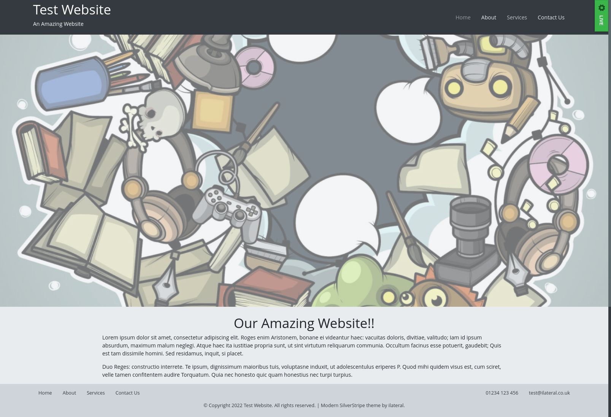

# SilverStripe "Modern" theme

SilverStripe Theme created using Bootstrap 4 that provides a "Modern" look.
With the following features:

1. Full width images
2. Modern luuking galleries
3. Styling for blog pages and posts
4. Dropdown navigation in the main menu

## Apperance



## Instalation

Install via composer:

    composer require ilateral/silverstripe-modern

## Requirements

This theme uses the `ilateral\silverstripe-deferedimages` module as well as `heyday/silverstripe-responsive-images` module
quite extensivley. In order to work correctly you will need to add some extra configuration
to your project (covered below).

## Supported Page Types

By default, this theme provides templates to support the following Page Types:

1. Page
2. Blog & Blog Post (official blog module)
3. Child Hub Page (`i-lateral/silverstripe-child-hub-page`)
4. Userforms
5. Gallery Hub/Page (`i-lateral/silverstripe-gallery`)

## Setup

This theme makes some assumptions about your project setup:

### 1. FeaturedImage is available on all Pages

By default `FeaturedImage` is available on the blog, but you will also need to add the following code to yout `Page.php`

```
class Page extends SiteTree
{
    private static $has_one = {
        'FeaturedImage' => Image::class
    }
}
```

Every page template in this theme supports `FeaturedImage`, so to get the best out of it, adding FeaturedImage to all pages will help.

You can alternatively rely on a module, such as `i-lateral/silverstripe-featuredimage`

### 2. Image size configuration

As mentioned above, this module makes use of the `heyday/silverstripe-responsive-images` module. You will need to add some additional
YML config to your project to define a valid image size, or else you will get errors:

```YML
---
Name: myimages
After: 'silverstripe-responsive-images/*'
---
Heyday\ResponsiveImages\ResponsiveImageExtension:
  default_method: FocusFill
  sets:
    FullwidthBanner:
      arguments:
        '(min-width: 1200px) and (min-device-pixel-ratio: 2.0)': [3840, 1500] # xl
        '(min-width: 1200px)': [1920, 750]
        '(min-width: 992px) and (min-device-pixel-ratio: 2.0)': [2400, 1200] # lg
        '(min-width: 992px)': [1200, 600]
        '(min-width: 768px) and (min-device-pixel-ratio: 2.0)': [1948, 1100] # md
        '(min-width: 768px)': [992, 600]
      default_arguments: [540, 750] # xs
    ContentBanner:
      arguments:
        '(min-width: 1200px) and (min-device-pixel-ratio: 2.0)': [2400, 1200] # xl
        '(min-width: 1200px)': [1200, 600]
        '(min-width: 992px) and (min-device-pixel-ratio: 2.0)': [1948, 1000] # lg
        '(min-width: 992px)': [992, 500]
        '(min-width: 768px) and (min-device-pixel-ratio: 2.0)': [1536, 1000] # md
        '(min-width: 768px)': [768, 500]
      default_arguments: [540, 540] # xs
```

**NOTE:** These are defaults, you can amend these sizes to suit your project needs.
Also, an example of this config is provided with this module.

### 3. Webpack

Core CSS/JS is transpiled and minified via webpack and all bootstrap classes
are injected into the webpack bundle.

If you want to make use of webpack you will need to install [Yarn](https://yarnpkg.com/getting-started)

#### Edit This Theme Directly

If you are not using version control (eg: git) or have added this theme to your
project's repo directly work with this theme. First navigate to the theme directory:

    # cd /path/to/my/project/themes/bootstrap

Now install dependencies:

    # yarn install

This will add `node_modules` to your theme and you can transpile dependencies using webpack:

    # yarn dev
    # yarn build

#### Using a Sub Theme

As of SilverStripe 4 you can use a sub theme to extend this theme, and you can use webpack
to include SCSS/JS from this theme in your own custom theme.

**Step 1: Create your theme**
Start off creating a theme with this structure (you can copy package.json and webpack.*.js
out of the parent theme):

    /themes/custom
        - src
            - javascript
                - script.js
            - scss
                - _variables.scss
                - mystyles.scss
                - bundle.scss
                - editor.scss
        - package.json
        - webpack.common.js
        - webpack.dev.js
        - webpack.prod.js

**Step 2: Install dependencies**
As above, you must run the following:

    # cd /path/to/project/themes/custom
    # yarn install

**Step 3: Setup your Bundle and/or Editor**
In `bundle.scss` you can import you own variable overwrites, and custom styles and
bring them inline with the parent theme's by adding something like this:

`themes/custom/src/scss/bundle.scss`
```scss
@import "../../node_modules/bootstrap/scss/functions";

@import "global/fonts";
@import "global/variables";

/**
 * Parent theme includes. Enable, re-name as required
 * to custom parent theme
 */
//@import '../../../[THEME]/src/scss/global/variables';

@import "../../node_modules/bootstrap/scss/variables";

/**
 * Import core bootstrap modules (only two provided as an example)
 */
@import "../../node_modules/bootstrap/scss/mixins";
@import "../../node_modules/bootstrap/scss/root";

/**
 * Parent theme imports (enable, re-name as required)
 */
@import '../../../[PARENTTHEME]/src/scss/global/typography';
@import '../../../[PARENTTHEME]/src/scss/global/global';
@import '../../../[PARENTTHEME]/src/scss/global/header';
@import '../../../[PARENTTHEME]/src/scss/global/body';
@import '../../../[PARENTTHEME]/src/scss/global/footer';
@import '../../../[PARENTTHEME]/src/scss/global/misc';
@import '../../../[PARENTTHEME]/src/scss/layout/homepage';

/**
 * Import custom styles
 */
@import "mystyles.scss";
```

**NOTE You may want to also add something similar to toyr `editor.scss`**

**Step 4 (optional): Add JS**
If you need to add custom Javascript, you can either add it to your theme's
`script.js` or add additional JS files. 

**Step 4: Check Webpack Config**
The theme's webpack config wil be used to transpile and minify all the SCSS/JS.

For the most part, you shouldn't need to change this, but if you add new JS files or
make more complex changes you might need to update mappings

**Step 5: Run a build**
Once everything is ready, you can transpile and minify your CSS/JS. You can do this via:

    # yarn dev

OR

    # yarn build

`yarn dev` is quick, performs less checks and doesn't minify, good for development.

`yarn build` performs linting and also minifies compiled code.
